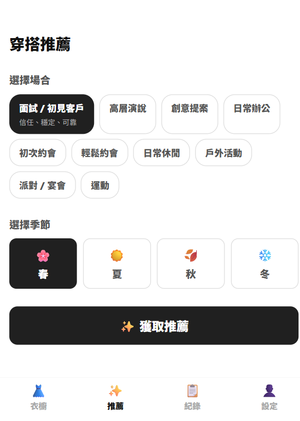
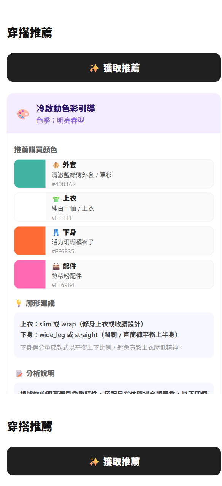
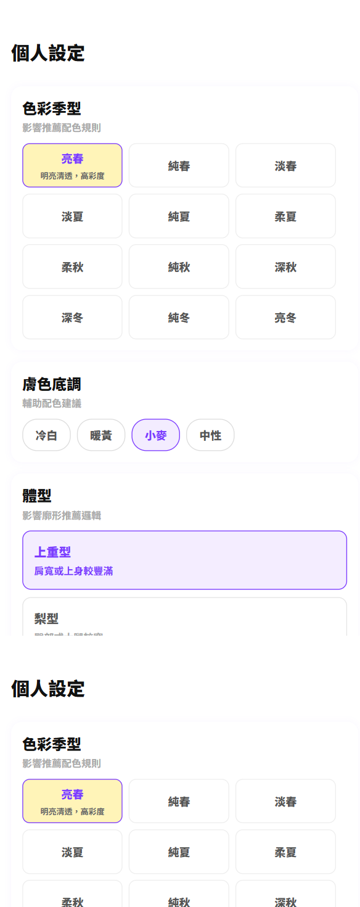
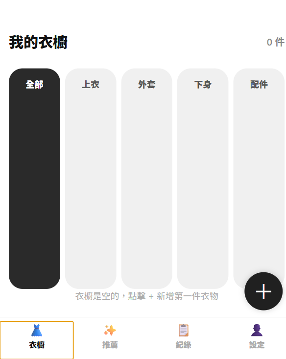

# WARDROBE AI

WARDROBE AI 是一個以「個人化穿搭推薦」為核心的 AI 衣櫥助理。
專案重點不是單純管理衣服，而是把使用者的色彩季型、膚色底調、體型、場合與季節轉換成可執行的穿搭建議。

目前版本已由 APK 展示改為 PWA，方便在 iPhone Safari、Android 與桌面瀏覽器直接開啟使用。

## 手機隨身展示目標

這個專案接下來的展示目標，是讓正式部署網址在手機上隨時可開啟，成為可以在外面直接拿給別人看的隨身作品。

展示標準：

- iPhone Safari / Android Chrome 可直接開啟。
- 不需要安裝 APK。
- 推薦頁、冷啟動畫面、個人設定與衣櫥頁可穩定瀏覽。
- Render 線上 API 與資料庫 endpoint 需要穩定，不能只依賴本機展示。

## 核心功能

- 冷啟動推薦：衣櫥還沒有資料時，也能依照個人設定產生色彩引導。
- 12 色季系統：亮春、純春、淡春、淡夏、純夏、柔夏、柔秋、純秋、深秋、深冬、純冬、亮冬。
- 個人設定：膚色底調、體型、色彩季型會影響推薦邏輯。
- 場合推薦：面試、簡報、創意辦公、約會、休閒、戶外、派對、運動等情境。
- 季節推薦：春、夏、秋、冬。
- 廓形建議：依照體型給出上衣與下身輪廓建議。
- PWA 展示：不再依賴 APK，可用手機瀏覽器直接操作。

## 展示畫面

### 穿搭推薦



### 冷啟動色彩引導



### 個人設定



### 我的衣櫥



## 技術架構

- Frontend: Expo, React Native, TypeScript, Expo Web / PWA
- Backend: Node.js, Express
- Database: PostgreSQL / Supabase
- Auth: JWT access token, refresh token
- Recommendation Engine: 色彩規則、材質規則、廓形規則、場合策略
- Deployment Target: Render + PWA

## 本機啟動

```bash
npm install
npm start
```

PWA build:

```bash
cd mobile
npm install
npm run build:web
```

伺服器會同時提供 API 與 PWA 靜態檔案。

## 線上展示驗證

```bash
npm run verify:production
```

目前正式展示目標是讓 Render URL 在手機外部網路也能穩定開啟。驗收細節見：

- `docs/MOBILE_DEMO_CHECKLIST.md`
- `RENDER_FIX_CHECKLIST.md`

## 目前狀態

30 天計畫中，WARDROBE AI 已完成第一週的主要展示目標：

- App 可登入或進入展示模式。
- PWA 可開啟，不再依賴 APK。
- 推薦頁、冷啟動畫面、個人設定與衣櫥頁已可展示。
- GitHub README 已補上中文說明與展示截圖。

下一步會進入部署與作品包裝階段：Render 穩定部署、GitHub repo topics/description、Demo URL 與 release note。
